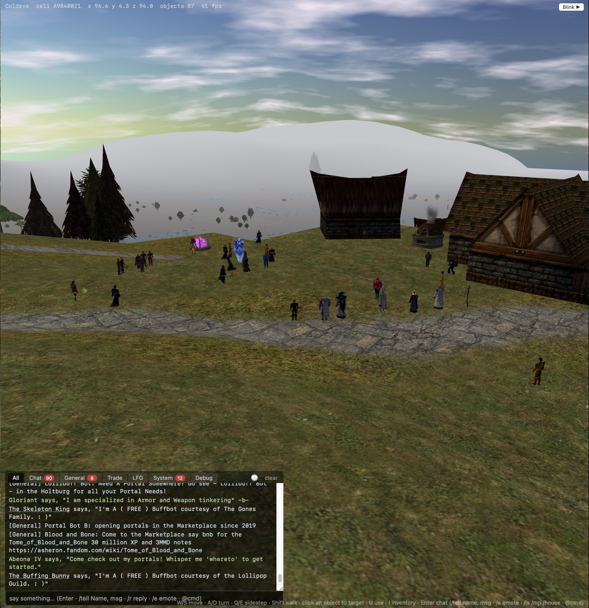

# acweb

A from-scratch browser client for Asheron's Call, written in TypeScript with
Three.js (WebGL 2). It reads the original `client_portal.dat` /
`client_cell_1.dat` files, which you must supply yourself, and plays on
[ACEmulator](https://github.com/ACEmulator/ACE) servers through a tiny
WebSocket-to-UDP relay. No server modifications are required; it has been
tested against Coldeve.

File formats, rendering rules and the network protocol are ported from ACE's
DatLoader / physics / network code and from ACViewer. Educational and
non-commercial. Never redistribute the DAT files. This is an unofficial client:
check the rules of any server before connecting to it.




## What works

- **DAT reader**: container B-tree, chained-sector files, and parsers for
  meshes (GfxObj), multi-part models (Setup), animations, motion tables,
  palettes, textures, surfaces, landblocks, landblock info, indoor cells
  (EnvCell), environments, regions, scenes, character generation, the skill
  table, particle emitters, physics scripts and script tables. `deno task verify` parses every record of each type in the retail dats
  and checks that each parser consumed exactly the file's bytes (885k files).
- **Outdoor world**: terrain with the client's TexMerge texture blending and
  roads, static objects, buildings, procedural scenery (trees, rocks, shrubs)
  placed with the client's PRNG rules.
- **Interiors**: building rooms and dungeons with furniture, camera-in-cell
  detection via the cell BSP, portal-style visibility.
- **Animation**: motion-table driven playback (transitions + cycles, action
  commands that play once and return to the cycle, server speed scaling), run/
  walk/turn/sidestep on the player, server-driven motions on other creatures.
- **Other players and NPCs**: dead-reckoned from their interpreted motion
  state (forward/sidestep velocity from the cycle animations, yaw rate from the
  turn cycle, MoveTo targets for NPCs); the server's position updates only
  correct the estimate, and corrections decay smoothly instead of teleporting.
- **Appearance**: clothing, armor, hair, skin and dye colors from each object's
  ObjDesc (part replacements, texture swaps, palette overlays); wielded and held
  items (weapons, shields, wands, torches) ride on the parent model's holding
  locations and follow its animation.
- **Networking**: the AC UDP protocol in the browser (checksums, ISAAC-keyed
  encrypted checksums, sequencing, acks, retransmits, fragments), login,
  character list, character creation, enter world, object streaming,
  positions, motions, chat (local, tells, emotes, General/Trade/LFG/Allegiance),
  Use / Give / Drop, inventory, recalls.
- **Sky and lighting**: the region's sky objects (dome, horizon, sun, moon,
  scrolling clouds) drawn around the camera, with time-of-day keyframed sun,
  ambient and fog driving the lights and terrain shader; Dereth time follows
  the server clock.
- **Particles**: emitters ported from the client's physics (still, velocity,
  parabolic, swarm, explode, implode types) drawn as billboards textured from
  the emitter's hardware GfxObj, or as clones of a real GfxObj mesh; created by
  animation hooks (spell wind-up orbs while casting), by the server's
  PlayEffect messages through each object's physics script table (buff and
  spell effects), and by each Setup's default script (portal vortices, which
  loop by calling themselves).
- **Collision**: walls, building interiors, scenery, closed doors and static
  server objects block the player (horizontal rays at knee and chest height,
  sliding along the wall); `/noclip` toggles walking through walls.
- **Client UI**: login and character creation, two-ring world streaming
  (full detail near the player, terrain-only to the horizon), third-person
  camera, click-to-target, inventory with the game's icons, tabbed chat with
  unread badges and Turbine channels, recall commands.

## Not yet

Combat, spellcasting, vendors, allegiance, fellowship, housing, water
surfaces, creature-to-creature collision, rain particles in the Rainy day
groups, sound.

## Running

### Ready-made executable

The easiest way to play: one program that serves the client, reads your dat
files and runs the relay. Nothing to install.

1. Download the build for your machine from the
   [latest release](https://github.com/FictitiousReality/ACWeb/releases/latest):
   `acweb-macos-arm64.tar.gz` (Apple Silicon), `acweb-macos-x64.tar.gz`
   (Intel Mac), `acweb-windows-x64.zip`, or `acweb-linux-x64.tar.gz`.
2. Unpack it. You get a folder `acweb` with the program inside.
3. Copy your Asheron's Call dat files into a folder named `dats` inside that
   folder: `client_portal.dat` and `client_cell_1.dat` are required,
   `client_local_English.dat` is optional. (The retail client's install
   folder has them; the game is free to download.) They are never included
   in a release.
4. Run `acweb` (double-click, or from a terminal). It prints the address,
   http://127.0.0.1:8000/play.html, and opens your browser there. Keep the
   program running while you play; Ctrl+C or closing its window quits.
5. On the page, leave the server at `play.coldeve.ac:9000` (or enter another
   ACEmulator server), enter your account and password, pick or create a
   character, and enter.

First-run prompts: macOS will say the program is from an unidentified
developer. Right-click it, choose Open, then Open again; or run
`xattr -d com.apple.quarantine acweb` in the folder. Windows SmartScreen
shows "Windows protected your PC": choose More info, then Run anyway. The
builds are unsigned, which is all those prompts mean.

Options, if you want them:

```bash
./acweb /path/to/dat/folder        # dats somewhere else (or set ACWEB_DATS)
./acweb --port 8000 --relay 8001   # ports
./acweb --no-open                  # don't open the browser
```

Updating: download the new release and replace the program; your `dats`
folder stays. To build the executables yourself: `deno task compile` (this
machine) or `deno task release` (all four targets into `dist/`).

### From source

Requires [Deno](https://deno.com) 2.x. Nothing else is installed by this project.

```bash
deno task build                    # bundles web/main.ts and web/play.ts into web/dist/
deno task serve ~/path/to/dats     # http://127.0.0.1:8000 — static files + /dat/* with Range support
deno task proxy                    # ws://127.0.0.1:8001 — WebSocket <-> UDP relay to the game server
deno task launch [datDir]          # both of the above in one process, and opens the browser
```

- **Play**: open http://127.0.0.1:8000/play.html, enter the server host and
  port (Coldeve is `play.coldeve.ac:9000`), your account and password, pick or
  create a character, enter. Add `?debug=1` to log every packet on the Debug tab.
  Your password is written only into the login packet.
- **Explore without a server**: http://127.0.0.1:8000/?auto=1 is a world and
  model viewer. Enter a landblock id (`A9B4` Holtburg, `0002` a dungeon) and a
  radius; the model field loads a Setup and plays its motions.
- Other tasks: `deno task verify` (parser check), `deno task scenery A9B4`
  (scenery placement stats), `deno task probe host port` (send a harmless
  empty-password login and print the server's reply).

## Controls

| Input | Action |
| --- | --- |
| W / S, Up / Down | run forward / walk backwards |
| A / D, Left / Right | turn |
| Q / E | sidestep |
| Shift (hold) | walk instead of run |
| R / F | rise / descend while flying (`/fly`) |
| Mouse drag | orbit the camera; wheel zooms |
| Click an object | target it (name and Use / Give buttons appear) |
| Space | jump (full charge; jump height uses a Jump skill pinned at 750 for now) |
| U | use the target |
| I | open or close the inventory |
| Enter | focus the chat box; Escape leaves it or clears the target |
| Blink button (top right) | jump one landblock in the facing direction |

Health, stamina and mana bars sit under the status line; the selected
target's name shows its health percentage once the server reports it.
Chat has tabs (All, Chat, General, Trade, LFG, Combat, System, and Debug with
`?debug=1`). Damage dealt and taken, and spell messages, go to Combat. Plain text typed on a channel tab goes to that channel; on the
other tabs it is local speech.

## Commands

Type these in the chat box.

| Command | What it does |
| --- | --- |
| `/tell Name, message` or `/t Name message` | private message |
| `/r message` | reply to the last person who sent you a tell |
| `/say text` or `/s text` | local speech (same as plain text on a non-channel tab) |
| `/e text`, `/me text`, `/emote text` | emote: "Name text" |
| `/g text`, `/general text` | General channel |
| `/tr text`, `/trade text` | Trade channel |
| `/lfg text` | LFG channel |
| `/a text`, `/allegiance text` | Allegiance channel (when you are in one) |
| `/use` | use the current target |
| `/inv`, `/i` | toggle the inventory panel |
| `/ls`, `/lifestone` | recall to your lifestone |
| `/mp`, `/marketplace` | recall to the Marketplace |
| `/house`, `/mansion`, `/hom`, `/hometown` | house, mansion and hometown recalls |
| `/pkarena`, `/pklarena` | PK and PK-lite arena recalls |
| `/time` | the current Dereth time of day (compare with the retail client's sky) |
| `/blink` | jump one landblock ahead (also the Blink button) |
| `/fly` | toggle fly mode: floors ignored, R and F move vertically, positions are reported airborne; `/fly` again lands you |
| `/noclip`, `/ghost` | toggle walking through walls |
| `/fxspeed 0.5` | playback speed of particle effects (1 = file timings, up to 4) |
| `@command` | anything starting with `@` is sent to the server as an admin/server command |

Blink, fly and noclip are testing aids. They rely on the server trusting the
client for its position, which is how the retail client worked too, and a
server's rules may treat using them around other players as cheating.

## Layout

- `src/dat/` — dat reader: byte sources (Deno file, browser Blob, HTTP Range), container, record parsers
- `src/world/` — pure data transforms: texture decoding, terrain geometry and blending, mesh building, scenery placement, cell tests, animation sequencing
- `src/net/` — AC network protocol: packet codec, checksum/ISAAC, session, message codecs, game client
- `src/render/` — Three.js side: asset cache, terrain shader, object placement, animated models, particles, world streaming, networked entities, player controller
- `src/tools/` — Deno tools: verify, scenery stats, server probe, dev server, relay
- `web/` — `index.html` (viewer), `play.html` (client), bundles in `dist/`
